# Tarea 2 - Triangulaciones de Delaunay Restringidas

Triangulaciones de Delaunay creadas con el algoritmo incremental con FlipEdge. Se realizó con la estructura de datos Half-Edge.

Se necesita tener instalados la librería de CGAL y todas las dependencias asociadas.

Las siguientes instrucciones se deben llevar a cabo en una terminal que se encuentre en el directorio principal del proyecto.
Para generar una build se utiliza el siguiente comando:

```bash
cmake -S . -B ./build
```

Para compilar se puede utilizar el siguiente comando:

```bash
cmake --build ./build -j 10
```

Esto generará múltiples ejecutables que se explicarán a continuación

## Resultados

### Geometría Rectangular

Para esta geometría se utiliza el siguiente comando:

```bash
build/rectangle.exe --points POINTS --size SIZE --output rect.off
```

- points: número entero. Si se entrega un valor mayo a 0 se agregan puntos aleatorios dentro del rectángulo.
- size: para generar un rectángulo de ancho size y un alto size/2 en una geometría cuadrada contenedora de tamaño 2\*size.
- output: nombre del archivo .off que contiene la triangulación. El default es rect.off

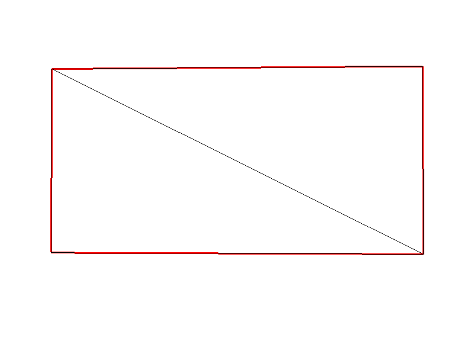

Se muestran las aristas restringidas que conforman el rectángulo de color rojo.

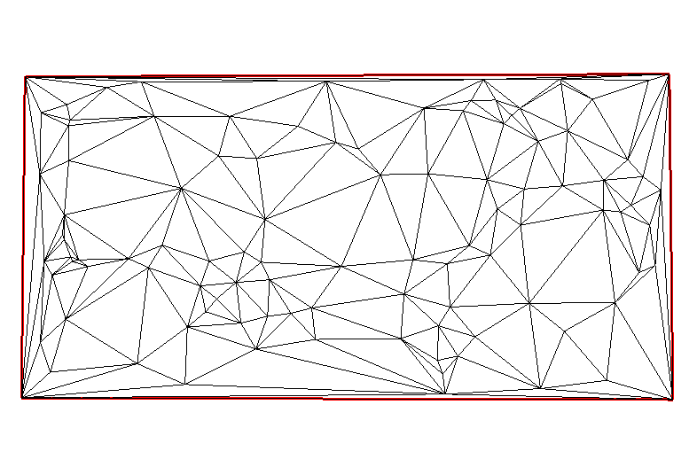

Se muestran las aristas restringidas que conforman el rectángulo de color rojo. Se llenó con 100 puntos aleatorios colocados dentro del mismo para demostrar que se respetan las restricciones.

### Geometría Rectangular con Línea dentro

Para esta geometría se utiliza el siguiente comando:

```bash
build/rec_w_line.exe --points POINTS --size SIZE --output rec_w_line.off
```

- points: número entero. Si se entrega un valor mayo a 0 se agregan puntos aleatorios dentro del rectángulo.
- size: para generar un rectángulo de ancho size y un alto size/2 en una geometría cuadrada contenedora de tamaño 2\*size.
- output: nombre del archivo .off que contiene la triangulación. El default es rec_w_line.off

Es un rectángulo con una línea horizontal colocada a la mitad de la altura del mismo.
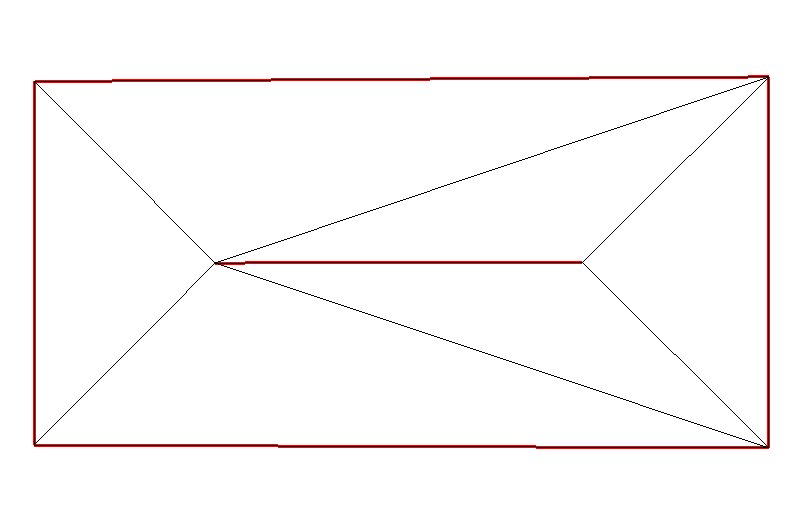

Se muestran las aristas restringidas que conforman el rectángulo de color rojo.

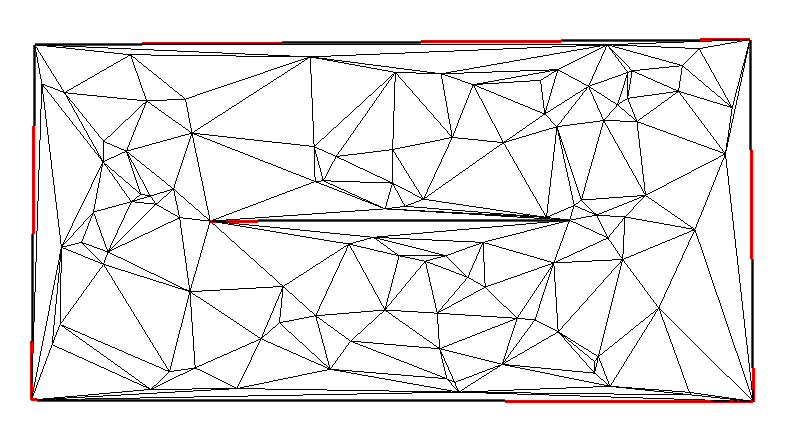

Se muestran las aristas restringidas que conforman el rectángulo de color rojo. Se llenó con 100 puntos aleatorios colocados dentro del mismo para demostrar que se respetan las restricciones.

### Geometría con forma de C

Para esta geometría se utiliza el siguiente comando:

```bash
build/c_shape.exe --points POINTS --size SIZE --output c_shape.off
```

- points: número entero. Si se entrega un valor mayo a 0 se agregan puntos aleatorios dentro del rectángulo.
- size: para generar los lados de la C en una geometría cuadrada contenedora de tamaño 2\*size.
- output: nombre del archivo .off que contiene la triangulación. El default es c_shape.off

Es una C formada por 3 rectángulos: arriba, a la izquierda y abajo.
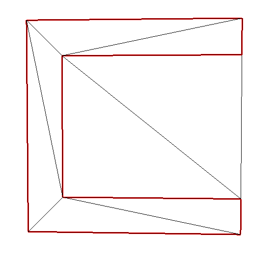

Se muestran las aristas restringidas que conforman el rectángulo de color rojo.

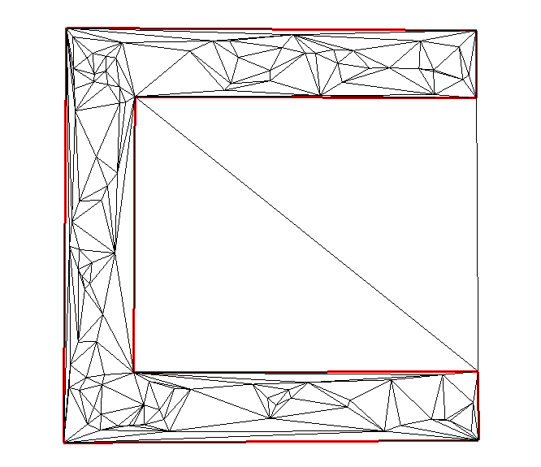

Se muestran las aristas restringidas que conforman el rectángulo de color rojo. Se llenó con 100 puntos aleatorios colocados dentro de la C para demostrar que se respetan las restricciones.

### Geometría Personalizada

Para esta geometría se utiliza el siguiente comando:

```bash
build/my_shape.exe --size SIZE --output my_shape.off
```

- size: para generar la geometría personalizada en una geometría cuadrada contenedora de tamaño 2\*size.
- div: numero entero de "dientes" de la geometría.
- output: nombre del archivo .off que contiene la triangulación. El default es my_shape.off

Es una geometría personalizada dentada.

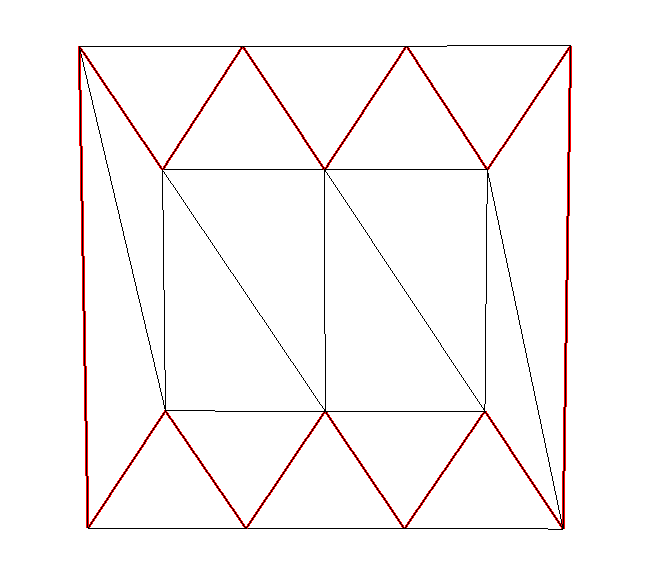

Se muestran las aristas restringidas que conforman el rectángulo de color rojo.

### Geometría aleatoria o rectangular con puntos aleatorios y/o LEPP

Para esta geometría se utiliza el siguiente comando:

```bash
build/main.exe --size SIZE --points POINTS --rectangular --restrictions RESTRICTIONS --rest_len RESTRICTIONS-LENGTH  --output output.off
```

- size: para generar la geometría personalizada en una geometría cuadrada contenedora de tamaño 2\*size.
- points: numero de puntos que tendrá la triangulació (sin contar restricciones).
- rectangular: bool sobre si se quiere un grid regular o puntos aleatorios.
- restrictions: numero entero de las restricciones que se quieren.
- rest_len: double que indica el largo máximo que tendrán las restricciones.
- output: nombre del archivo .off que contiene la triangulación. El default es output.off

Grid regular con 15 restricciones aleatorias de color rojo.

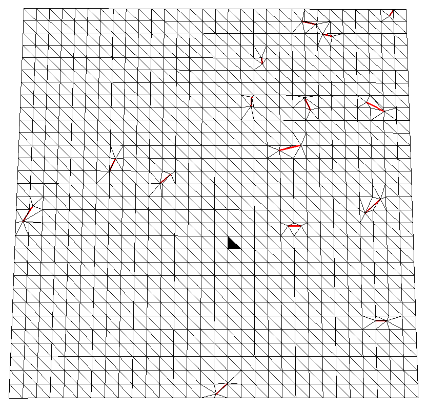

Puntos aleatorios con 15 restricciones aleatorias de color rojo.

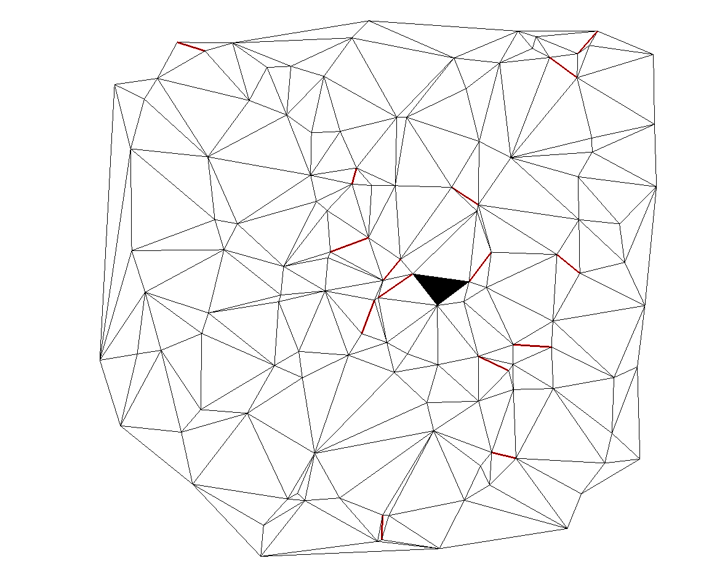

Se tiene además implementado el algoritmo de LEPP. El camino que se buscará es el del triángulo de color negro.

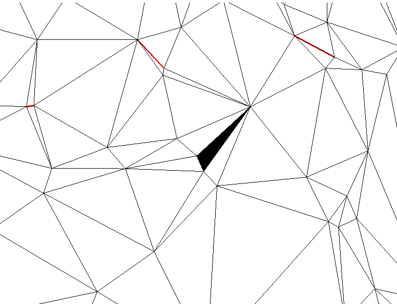

El camino se marca por una serie de triángulos negros.

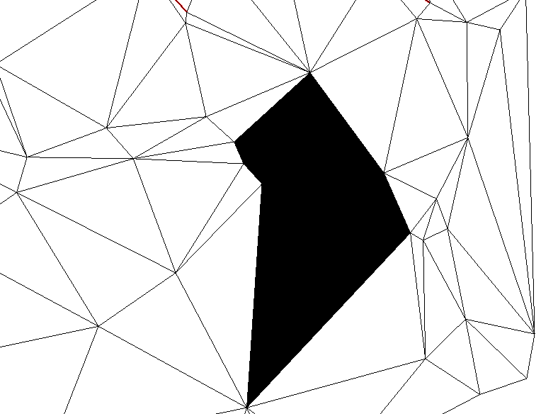

## Controles

- Para mover la cámara se utilizan las teclas WASD.

- Para ascender se utiliza SPACE.

- Para descender LSHIFT.

- Con la rueda del mouse se puede hacer zoom.

- En el ejecutable main.exe además se tienen controles para el LEPP, en el cual con el click izquierdo sobre un triángulo marcado se calculará y dibujará el LEPP del mismo.

- Con el click derecho se limpiará el camino.

- Con la tecla Escape se cierra la visualización.

## Author

Sebastián Mira Pacheco
